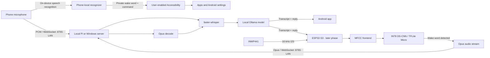

# Ira

**A privacy-first local-network voice assistant and edge wake-word system**
Smart India Hackathon 2026 · ISRO problem statement **SIH26172** · Team **NeuroVox**

Tap-to-talk on Android and voice requests from the ESP32 use the same local
Raspberry Pi/Windows server for transcription and assistant replies. Android
streams 16 kHz PCM and the ESP32 streams Opus over WebSocket on the private
LAN. Android's optional wake-word/device-control mode remains phone-local.

## Architecture



See [docs/architecture.md](./docs/architecture.md) for the full data flow.

## Hardware

- ESP32-S3 DevKitC-1
- INMP441 I2S MEMS microphone
- Local Raspberry Pi or Windows laptop on the same WiFi network

| INMP441 | ESP32-S3 DevKitC-1 |
|---|---|
| VDD | 3V3 |
| GND | GND |
| L/R | GND |
| SCK | GPIO26 |
| WS | GPIO25 |
| SD | GPIO33 |

Detailed notes: [hardware/wiring.md](./hardware/wiring.md).

## Quick start

### Android phone app (current phase)

Install Android Studio with Android SDK Platform 35 and open the `phone`
folder as a project. Let Gradle sync, connect an Android 12+ phone with USB
debugging enabled, and run the `app` configuration. Connect the phone to the
same trusted Wi-Fi network as the Pi, enter its address in Ira's **Raspberry
Pi Server** card (for example, `ws://192.168.1.50:8765/`), and tap **Save Pi
address**. **Start talking** streams audio to the Pi for transcription and
assistant replies; the server accepts up to 30 seconds per utterance.

For hands-free device control, enable Ira's Accessibility service in Android
settings and start private wake-word listening. Say “Ira” followed by a
command to open apps or settings, tap visible controls, type into the focused
field, or navigate. This optional control mode continues to use the phone's
on-device recognizer. A foreground notification and Android's microphone
indicator remain visible while it listens. See [phone/README.md](./phone/README.md)
for setup details and the WebSocket transport's LAN security limits.

### Firmware

Install PlatformIO and create a private configuration file (the example has
placeholders and is not usable until edited):

```powershell
Copy-Item .\firmware\include\secrets.example.h .\firmware\include\secrets.h
notepad .\firmware\include\secrets.h
```

Set the WiFi SSID/password and the server's LAN hostname or address in
`secrets.h`. Do not commit it. With the device connected over USB:

```powershell
pio run -d .\firmware
pio run -d .\firmware -t upload
pio device monitor -d .\firmware -b 115200
```

The firmware currently contains a deliberately invalid model placeholder and
will report that KWS is unavailable until the trained model is exported to
`firmware/src/model_data.h`.

### Collect data and train the wake-word model

Use Python 3.10 for the TensorFlow 2.10 Windows-compatible training toolchain.
Create a balanced set of “Ira” utterances and negative speech/noise examples.
All non-`ira` class directories are combined into the `unknown` class:

```powershell
py -3.10 -m venv .venv-ml
.\.venv-ml\Scripts\Activate.ps1
python -m pip install -r .\ml\requirements.txt
python .\ml\collect_dataset.py --label ira --count 100
python .\ml\collect_dataset.py --label unknown --count 100
python .\ml\collect_dataset.py --label noise --count 100
python .\ml\train.py
python .\ml\quantize.py
python .\ml\export_c_array.py
```

Record in varied environments, with multiple speakers, distances, and
background conditions. Preserve participant consent and do not collect
unnecessary personal audio. Inspect validation results and test false
activations before deployment.

### Server on Windows

Use Python 3.10 or newer, then install the server dependencies in a virtual
environment:

```powershell
py -3 -m venv .venv-server
.\.venv-server\Scripts\Activate.ps1
python -m pip install -r .\server\requirements.txt
ollama pull tinyllama:latest
python .\server\server.py
```

The server binds to `0.0.0.0:8765`. Allow Python through Windows Firewall on
your private WiFi network if prompted. Configure the ESP32 host in `secrets.h`
and enter the same server LAN address in the Android app. Keep both clients and
the server on the same trusted LAN; do not use or expose a public internet
address. `ws://` traffic is unencrypted, so do not forward port 8765 from the
router. The Ira server starts local Ollama automatically when it is not already
running. Install Ollama and pull a model once; set `IRA_OLLAMA_MODEL` before
starting the server to select another installed model. See
[server/README.md](./server/README.md).

### Raspberry Pi and offline server model caching

On the Pi, create a virtual environment and install `server/requirements.txt`.
Before disconnecting from the internet, download the selected model once:

```sh
python3 -m venv .venv
. .venv/bin/activate
python -m pip install -r server/requirements.txt
python -c "from faster_whisper import WhisperModel; WhisperModel('small', device='cpu', compute_type='int8')"
```

Set the environment variable before starting the service to prevent network
access:

```sh
HF_HUB_OFFLINE=1 IRA_WHISPER_MODEL=small python server/server.py
```

On Windows, use PowerShell after installing the model:

```powershell
$env:IRA_WHISPER_MODEL = "small"
$env:HF_HUB_OFFLINE = "1"
python .\server\server.py
```

If using a custom Hugging Face cache, set `HF_HOME` to the same directory
during both download and offline operation. `HF_HUB_OFFLINE=1` is passed
through unchanged, so an uncached model fails visibly instead of silently
attempting a download.

## Current metrics

No performance figures have been measured yet. Fill in this table only with
repeatable measurements from the target hardware.

| Metric | Target / constraint | Measured |
|---|---:|---:|
| Wake-word-to-stream latency | TBD | TBD |
| Transcription latency | TBD | TBD |
| Idle CPU utilization | <10% | TBD |
| MCU RAM use | <256 KB | TBD |

## Repository map

- `phone/` — Android Kotlin/Compose app with Pi-backed tap-to-talk, optional
  phone-local device control, and private WAV collection.
- `firmware/` — later-phase PlatformIO ESP32-S3 application, I2S capture,
  MFCC/TFLite Micro inference, WebSocket and Opus streaming.
- `ml/` — WAV dataset collection, shared MFCC frontend, DS-CNN training,
  integer quantization, and C-array exporter.
- `server/` — asynchronous WebSocket endpoint and offline faster-whisper
  transcription; see [server/README.md](./server/README.md) for platform setup.
- `hardware/` — wiring table and notes.
- `docs/` — architecture and pipeline documentation.

## Team

**NeuroVox** · Smart India Hackathon 2026 · ISRO problem statement SIH26172.

## License

MIT; see [LICENSE](./LICENSE). Third-party libraries retain their respective
open-source licenses.
