# Architecture

```mermaid
flowchart LR
    Mic[INMP441 MEMS microphone] -->|I2S, 16 kHz| Capture[ESP32-S3 audio capture task]
    Capture --> Ring[1 s rolling PCM window]
    Ring --> MFCC[MFCC frontend]
    MFCC --> KWS[INT8 DS-CNN / TFLite Micro]
    KWS -->|Ira detected| Trigger[Voice stream trigger]
    Capture -->|16-bit PCM frames| Opus[Opus encoder]
    Trigger --> Opus
    Opus -->|WebSocket, port 8765| Server[Local Raspberry Pi or Windows server]
    Server --> Decode[Opus decode / 16 kHz resample]
    Decode --> Whisper[faster-whisper, cached model]
    Whisper -->|JSON transcript + latency| Client[WebSocket client]
```

## Data flow

1. A FreeRTOS capture task reads 20 ms, mono PCM frames from the I2S microphone.
2. The KWS task evaluates a one-second rolling window every 100 ms. The
   frontend shape is 49 frames by 40 MFCC coefficients and its definition is
   kept aligned in `ml/features.py` and `firmware/src/kws.cpp`.
3. After an `Ira` score reaches the configured threshold, the streaming task
   sends a JSON `start` message, then one binary WebSocket message per 20 ms
   Opus packet, and finally a JSON `end` message. Audio ends after one second
   of detected silence or ten seconds, whichever comes first.
4. The server decodes Opus, resamples to 16 kHz, transcribes the utterance, and
   returns `{"type":"transcript","text":"...","latency_ms":123.4}`. Error
   replies use `{"type":"error","message":"..."}`.

The TFLite model in firmware is a placeholder until the team records data,
trains the project-specific wake-word model, quantizes it, and exports it.
