# Architecture

```mermaid
flowchart LR
    Phone[Android phone app] -->|16 kHz PCM / WebSocket| Server
    Mic[INMP441 MEMS microphone] -->|I2S, 16 kHz| Capture[ESP32-S3 audio capture task]
    Capture --> Ring[1 s rolling PCM window]
    Ring --> MFCC[MFCC frontend]
    MFCC --> KWS[INT8 DS-CNN / TFLite Micro]
    KWS -->|Ira detected| Trigger[Voice stream trigger]
    Capture -->|16-bit PCM frames| Opus[Opus encoder]
    Trigger --> Opus
    Opus -->|WebSocket, port 8765| Server[Local Raspberry Pi or Windows server]
    Server --> Decode[Opus decode / 16 kHz resample]
    Decode --> Whisper[faster-whisper, cached model]
    Whisper -->|JSON transcript + latency| Client[Phone app or ESP32]
```

## Data flow

1. The Android app captures 20 ms, mono 16-bit PCM frames after the user taps
   to talk. The ESP32 path reads the same frame size from its I2S microphone.
2. The KWS task evaluates a one-second rolling window every 100 ms. The
   frontend shape is 49 frames by 40 MFCC coefficients and its definition is
   kept aligned in `ml/features.py` and `firmware/src/kws.cpp`.
3. The Android MVP sends a JSON `start` message with `codec` set to
   `pcm_s16le`, followed by binary 16-bit PCM messages and a JSON `end`
   message. The ESP32 path sends the same control messages and binary Opus
   packets. The phone stops on user input or after 30 seconds; the ESP32
   currently limits its stream to ten seconds.
4. The server decodes Opus, resamples to 16 kHz, transcribes the utterance, and
   returns `{"type":"transcript","text":"...","latency_ms":123.4}`. Error
   replies use `{"type":"error","message":"..."}`.

The TFLite model in firmware is a placeholder until the team records data,
trains the project-specific wake-word model, quantizes it, and exports it. The
phone MVP uses tap-to-talk; it does not claim wake-word detection yet.
