# Architecture

```mermaid
flowchart LR
    Mic[Phone microphone] -->|16 kHz PCM / WebSocket :8765 · LAN| Server[Local Raspberry Pi or Windows server]
    Server --> Whisper[faster-whisper · cached model]
    Whisper --> Ollama[Local Ollama assistant]
    Ollama -->|Transcript + reply JSON| PhoneUI[Ira Android app]
    AndroidASR[Phone-local on-device recognizer] -->|Private wake word + command| Accessibility[User-enabled Accessibility service]
    Accessibility -->|Visible app controls / Android Settings| Apps[Apps and settings]
    PhoneMic[Phone microphone] -->|Manual local dataset capture| PhoneDataset[Private phone WAV samples]
    DeviceMic[INMP441 MEMS microphone] -->|I2S, 16 kHz| Capture[ESP32-S3 audio capture task]
    Capture --> Ring[1 s rolling PCM window]
    Ring --> MFCC[MFCC frontend]
    MFCC --> KWS[INT8 DS-CNN / TFLite Micro]
    KWS -->|Ira detected| Trigger[Voice stream trigger]
    Capture -->|16-bit PCM frames| Opus[Opus encoder]
    Trigger --> Opus
    Opus -->|WebSocket, port 8765 · LAN| Server
    Server --> Decode[Opus decode / 16 kHz audio]
    Decode --> Whisper
    Ollama -->|Assistant reply JSON| ESP32[ESP32]
```

## Data flow

1. Tap-to-talk records mono 16 kHz PCM and streams it to the configured server
   over WebSocket. The Pi runs faster-whisper and local Ollama, returning the
   transcript and assistant reply. The optional private wake-word/device
   control feature remains phone-local; it uses Android's on-device recognizer
   and only operates after the user enables Accessibility access.
2. The phone dataset tool saves one-second, 16 kHz mono WAV samples to
   app-private storage; samples are not sent to the model host or Ira server.
   The phone's live listener does not use those custom samples yet. The ESP32
   KWS task evaluates a one-second rolling window every 100 ms. Its frontend
   shape is 49 frames by 40 MFCC coefficients, aligned between `ml/features.py`
   and `firmware/src/kws.cpp`.
3. The ESP32 sends Opus audio to the same server over a private LAN WebSocket.
   Android sends PCM using the same start/audio/end protocol. The server
   serializes Whisper inference while allowing both clients to remain
   connected; replies are generated by Ollama on the server computer.
4. The phone Accessibility service reads visible control labels only when
   carrying out an explicit spoken command. It can open apps and Android
   settings, operate exact visible labels, enter text in the focused field,
   scroll, and use basic navigation. Android limits direct changes to many
   settings, so those commands open the relevant settings screen for user
   review. No screen content is transmitted to the Ira server.

The firmware TFLite model is a placeholder until the team records data,
trains the project-specific wake-word model, quantizes it, and exports it.
The phone has local sample collection and an independent live listener.
